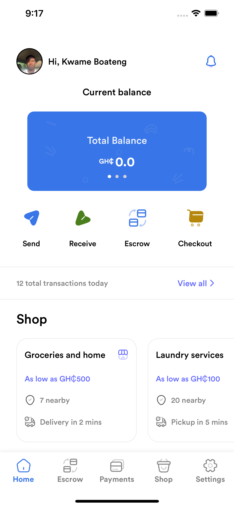
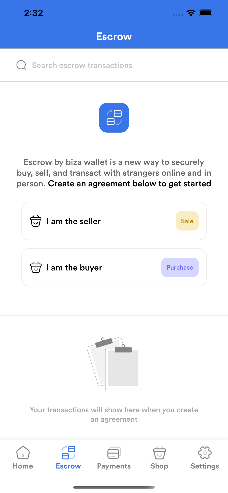
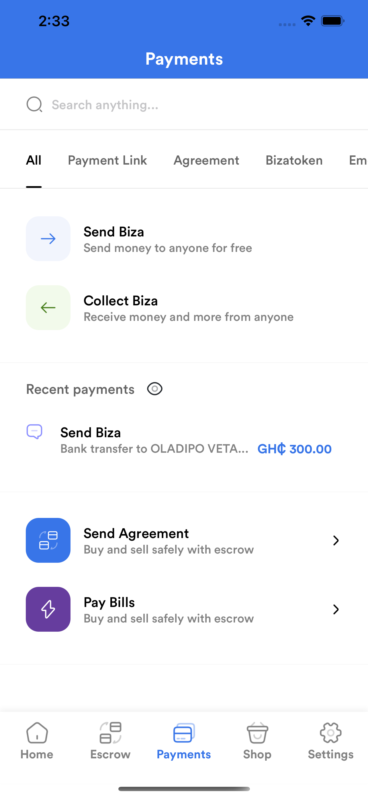
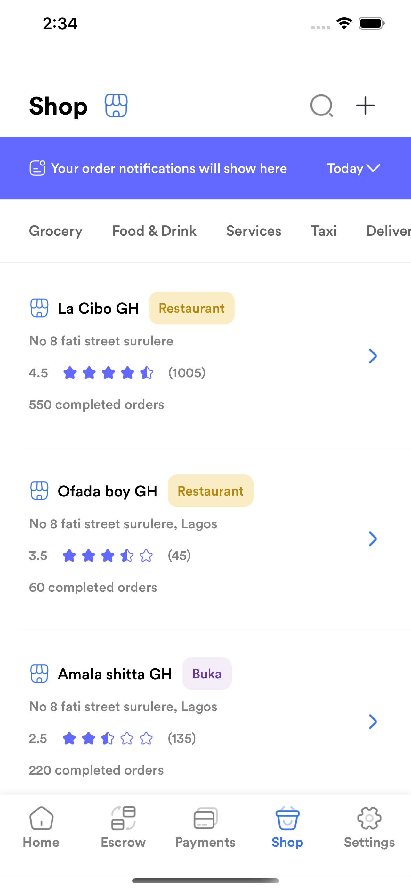
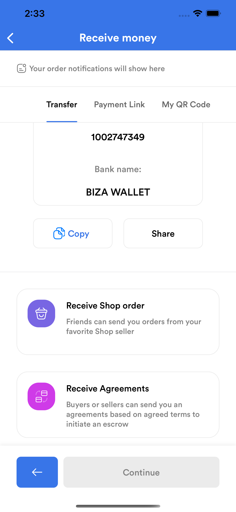

# Biza-Biza
BizaBiza is a platform to move money better and faster.
Escrow by biza wallet is a new way to securely buy, sell, and transact with strangers online and in person.

### Note ⚙️
The application was built using: 
* Xcode 12.5.1
* Swift 5.4
* macOS Big Sur 11.5.2

### Core Technologies 📲
* Swift
* UIKit
* Programmatic UI

# Screenshots 📸

